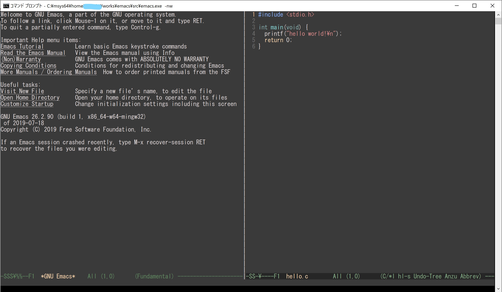

# Emacs with 256/true color support in Windows Console

## Background
- Current emacs in Windows Console (`emacs -nw` at cmd.exe) support only 16 colors.
- Windows Console recently support true color by Virtual Terminal sequences.
- Windows Terminal will come.
- Vim already support truecolor in Windows Console.(https://github.com/vim/vim/commit/cafafb381a04e33f3ce9cd15dd9f94b73226831f)

## Try
**Note**: This is experimental.

build environment: Windows 10, MSYS2 and MINGW-w64

1. configure

do `configure` and `make` in mintty (MSYS2/MINGW-w64).

```sh
./autogen.sh
./configure --without-dbus
```

2. add `-DW32CONVT256COLOR` to CFLAGS (to src/Makefile)

```c
CFLAGS = -g3 -O2 -gdwarf-2 -DW32CONVT256COLOR
```

3. make

```sh
make -j
```

4. run

run emacs in cmd.exe or powershell.exe.

```
path\to\src\emacs.exe -nw
```

## screenshot
with zenburn theme



## Bug
- loading no theme make bug at W32CONVT24BIT
-

## future work
- use escape sequences more (not only color)
-